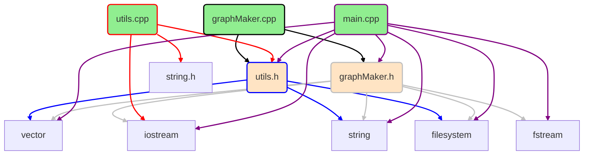

# Graph maker

Creates graphs of the cpp/c project:

- class
- file connections
- functions

**this is a project in progress - its not done yet!**

## Example of include graph output



## How to run

1. install `cmake`
1. `mkdir build`
1. `cd build`
1. `cmake ..`
1. `make`
1. `./graph-maker <path> [exclude list] `

## How to convert mermaid to graph

1. install npm `sudo apt install npm`
1. `npm install @mermaid-js/mermaid-cli`
1. `./node_modules/.bin/mmdc -h`
   > example: `./node_modules/.bin/mmdc -i ./includes.txt -o includes.pdf -f`

### If have an error

```bash
$ sudo apt-get update
$ sudo apt-get install -y libgbm-dev
# sometimes needs more:
$ sudo apt-get install libatk1.0-0 libatk-bridge2.0-0 libcups2 libxkbcommon-x11-0 libxcomposite1 libxdamage1 libxfixes3 libxrandr2 libgbm1 libpango-1.0-0 libcairo2
```
